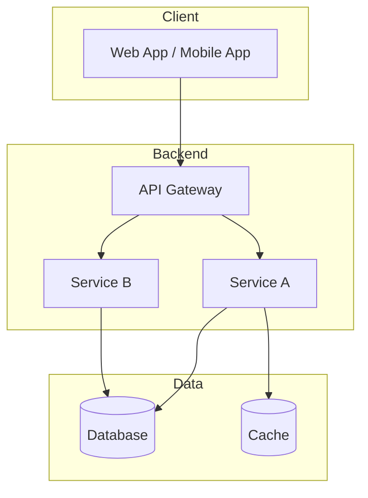

# System Overview: <Project Name>

**Date**: YYYY-MM-DD
**Author**: Architect Agent
**Status**: Draft | Review | Approved

---

## Architecture Diagram

_Replace with actual architecture._

## Components

| Component | Responsibility | Technology |
|-----------|---------------|------------|
| ... | ... | ... |

## Communication Patterns

| From | To | Protocol | Pattern |
|------|----|----------|---------|
| Client | API Gateway | HTTPS | Request/Response |
| ... | ... | ... | ... |

## Deployment Topology

_Describe how the system is deployed (cloud provider, containers, serverless, etc.)._

## Cross-Cutting Concerns

| Concern | Approach |
|---------|----------|
| Authentication | ... |
| Logging | ... |
| Error Handling | ... |
| Monitoring | ... |
